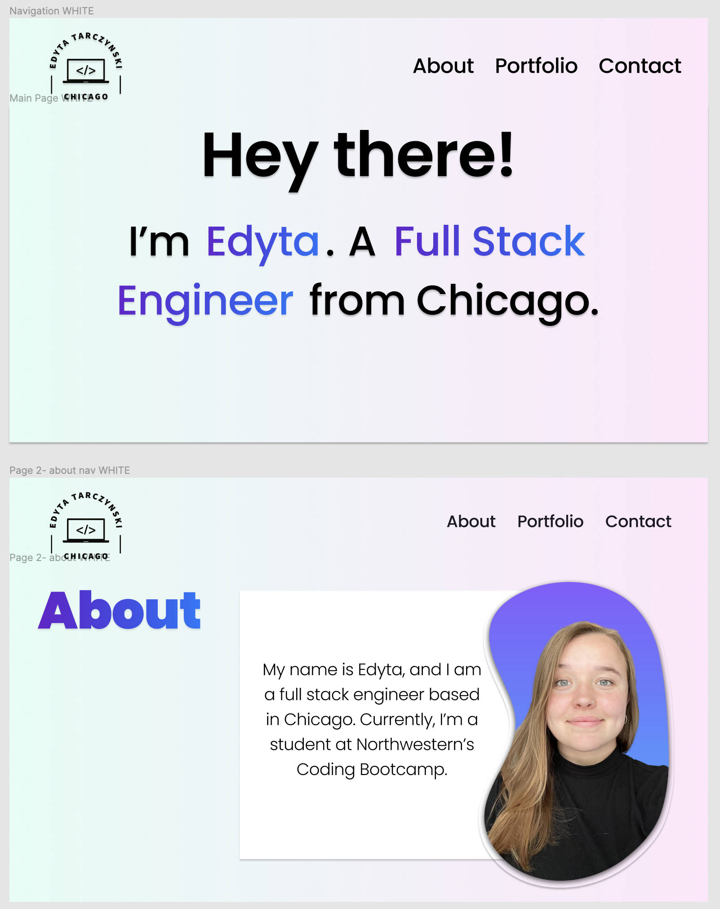
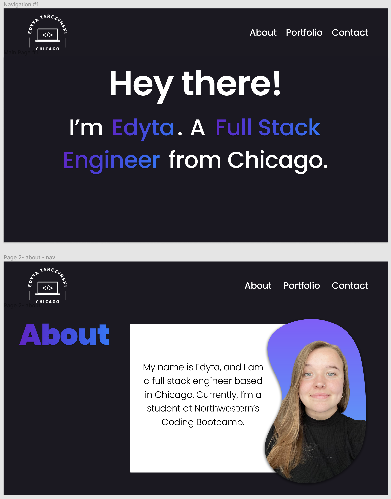

# Portfolio

## Task

My task was to build a portfolio page which I can add to as the course progresses. I was given the below User Story and Acceptance Criteria.

&nbsp;
## User Story
 
```
AS AN employer
I WANT to view a potential employee's deployed portfolio of work samples
SO THAT I can review samples of their work and assess whether they're a good candidate for an open position
```

## Acceptance Criteria

```
GIVEN I need to sample a potential employee's previous work
WHEN I load their portfolio
THEN I am presented with the developer's name, a recent photo or avatar, and links to sections about them, their work, and how to contact them
WHEN I click one of the links in the navigation
THEN the UI scrolls to the corresponding section
WHEN I click on the link to the section about their work
THEN the UI scrolls to a section with titled images of the developer's applications
WHEN I am presented with the developer's first application
THEN that application's image should be larger in size than the others
WHEN I click on the images of the applications
THEN I am taken to that deployed application
WHEN I resize the page or view the site on various screens and devices
THEN I am presented with a responsive layout that adapts to my viewport
```

&nbsp;
## The Planning Process

Before I started coding, I explored different design and layout ideas. It was difficult to narrow it down, but once I did, I began to wireframe on Figma. I wireframed two different color options: light and dark. 

> First Two Pages of the Light Colored Option



&nbsp;
> First Two Pages of the Dark Colored Option



I ended up going with the dark colored option. 

&nbsp;
## Future Considerations

I struggled with coding the site exactly with how I designed it on Figma. As the course progresses and I learn new frameworks and languages, I would like to revisit this project. I will try a different layout, use Bootstrap, and React. I believe this will give my design more flexibility and make it more responsive.   

&nbsp;
Additionally, I would like to switch my portfolio over to the lighter version. The dark seems a little too heavy.  

&nbsp;
## Link

The link to the deployed page is https://edytatar.github.io/Portfolio/. 